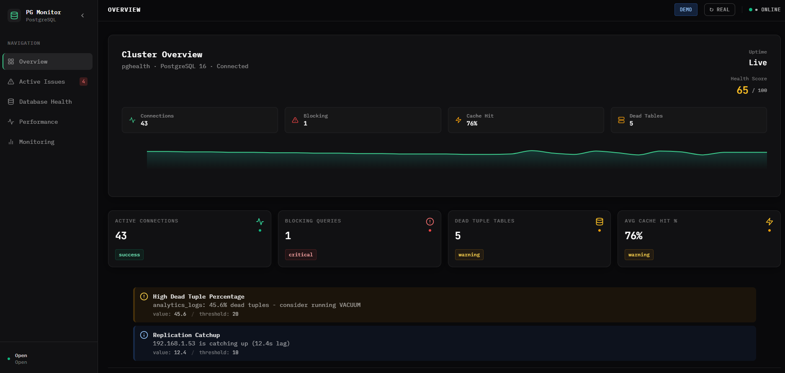
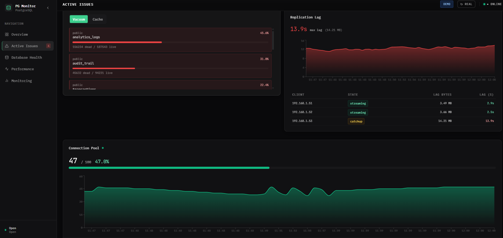
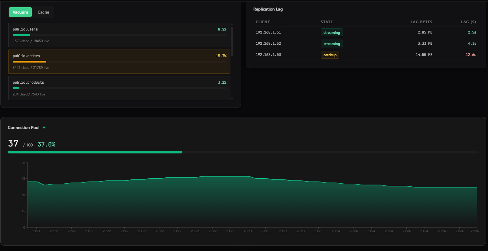
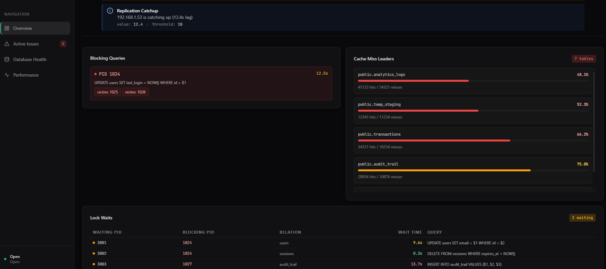
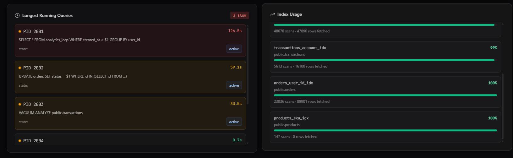

# Dashboard Screenshots & Feature Showcase

Visual guide to PostgreSQL Health Monitor features and interface.

---

## 🎯 Overview Dashboard

**Health Score Display (65/100)**



**Features shown:**
- 🟡 Health Score: 65/100 (Caution range)
- ✅ Connections: 43 active (success status)
- 🔴 Blocking Queries: 1 (critical status)
- ⚠️ Dead Tables: 5 (warning status)
- 📊 Cache Hit: 76% (good performance)
- 📱 DEMO/REAL mode toggle
- 🔗 Connection status indicator
- ℹ️ Alert notifications (High Dead Tuple Percentage, Replication Catchup)

---

## 🔴 Active Issues & Monitoring

**Real-time Issue Detection Dashboard**



**Features shown:**
- 📍 Navigation: Overview, Active Issues, Database Health, Performance, Monitoring
- 🟡 Active Issues Badge: 4 current issues
- 🔴 Blocking Queries Section:
  - PID 1024 running UPDATE query
  - Duration: 12.5s
  - Blocking PIDs: 1025, 1026
- 📊 Cache Miss Leaders:
  - Multiple tables with miss rates
  - Color-coded severity (red/amber)
  - Hit/miss statistics
- 🔒 Lock Waits Table:
  - Waiting/Blocking PIDs
  - Query relations
  - Wait times

---

## 📊 Database Health Metrics

**Vacuum Stats, Cache Ratio, Replication Lag**



**Features shown:**
- 🧹 Vacuum Stats (Left Panel):
  - Tab navigation (Vacuum/Cache)
  - public.users: 8.2% dead tuples
  - public.orders: 15.7% dead tuples
  - public.products: 3.1% dead tuples
  - Color-coded status bars

- 📶 Replication Lag (Right Panel):
  - 3 replica clients showing state
  - 192.168.1.51: streaming, 2.85 MB, 2.5s lag
  - 192.168.1.52: streaming, 3.33 MB, 4.3s lag
  - 192.168.1.53: catchup, 14.55 MB, 12.6s lag
  - Real-time lag tracking

- 🔗 Connection Pool:
  - Current: 37/100 (37.0%)
  - Green progress bar
  - Historical line chart
  - Smooth animations

---

## ⚠️ Critical Issues & Metrics

**Active Issues with Details**



**Features shown:**
- ℹ️ Replication Catchup Alert:
  - 192.168.1.53 is catching up (12.4s lag)
  - Value: 12.4, Threshold: 10

- 🔴 Blocking Queries:
  - PID 1024 with UPDATE query
  - Duration: 12.5s
  - Blocking other PIDs (1025, 1026)
  - Victim indicators

- 💾 Cache Miss Leaders:
  - public.analytics_logs: 48.1% miss rate
  - public.temp_staging: 52.3% miss rate
  - public.transactions: 66.2% miss rate
  - public.audit_trail: 75.0% miss rate
  - Hit/miss statistics

- 🔒 Lock Waits:
  - 3 waiting processes
  - Blocking query information
  - Relation names
  - Wait time metrics

---

## 📈 Performance Analysis

**Longest Running Queries & Index Usage**



**Features shown:**
- ⏱️ Longest Running Queries (Left):
  - PID 2001: SELECT query (126.5s)
  - PID 2002: UPDATE query (59.1s)
  - PID 2003: VACUUM ANALYZE (33.5s)
  - PID 2004: Other query (8.7s)
  - "3 slow" indicator
  - Query state: active

- 📊 Index Usage (Right):
  - transactions_account_idx: 99% usage
  - 46870 scans, 47890 rows fetched
  - orders_user_id_idx: 100% usage
  - 5613 scans, 16100 rows fetched
  - products_sku_idx: 100% usage
  - 147 scans, 0 rows fetched
  - Color-coded efficiency bars

---

## 💡 Key UI Elements

### Status Indicators

**Color Scheme:**
- 🟢 **Green**: Healthy, good performance
- 🟡 **Yellow/Amber**: Caution, needs attention
- 🔴 **Red**: Critical, immediate action needed
- 🔵 **Blue**: Informational status

### Health Score Ranges

```
🟢 80-100: Healthy
🟡 60-79:  Caution
🟠 40-59:  Warning
🔴 0-39:   Critical
```

### Adaptive Polling Indicators

- **Connection Pool Icon (Green)**: Connected, normal polling (10s)
- **Pulse Animation**: Active monitoring, fast polling (2s-3s)
- **Last Update Timestamp**: Indicates data freshness

---

## 🎯 Interactive Features

### Query Cards
Each query card displays:
- PID (Process ID)
- Query text (expandable)
- Duration
- Blocking status
- Copy to clipboard button
- Kill button (with confirmation)

### Search & Filter
- Full-text search in Query Explorer
- Filter by state (active/idle/waiting)
- Sort by any column
- Real-time results

### Notifications
- Toast alerts appear bottom-right
- Auto-dismiss after 5s
- Manual dismiss option
- Color-coded by severity

---

## 📱 Responsive Design

**Mobile View (Bottom Navigation):**
- Single column layout
- Touch-friendly buttons
- Bottom navigation bar
- Horizontal scroll for tables

**Tablet View (Transition):**
- 1-2 column grid
- Sidebar visible
- Optimized spacing

**Desktop View (Full Features):**
- 2-column grid layout
- Sidebar navigation
- All widgets visible
- Optimal spacing

---

## 🎨 Design Features

### Glassmorphism Cards
- Semi-transparent backgrounds
- Blur effect backdrop
- White text for contrast
- Smooth shadows

### Smooth Animations
- Entrance animations (fade + slide-up)
- Staggered reveals (0.08s delay)
- Pulse animations (1.8s cycle)
- 60 FPS performance

### Professional Typography
- Headers: Uppercase, tracked
- Metrics: JetBrains Mono, tabular-nums
- Body: System fonts (SF Pro, Segoe UI, Roboto)

---

## 🚀 Feature Highlights

### Real-time Updates
- WebSocket-based synchronization
- HTTP polling fallback
- Adaptive intervals (2s-10s)
- Last update timestamp

### Error Resilience
- Per-widget error boundaries
- Graceful fallback UI
- Retry buttons
- No cascading failures

### Comprehensive Monitoring
- 13+ metric categories
- 22 reusable components
- Configurable thresholds
- Custom alert rules

---

## 🎬 User Workflows

### Workflow: Investigating Blocking Query
1. See alert for blocking query in Active Issues
2. Click to view Blocking Queries section
3. See blocking query card with details
4. Expand query to see full text
5. Click "Kill" button with confirmation
6. Receive success notification
7. System auto-updates with new blocking query status

### Workflow: Monitoring Replication
1. Check Overview for health score
2. Navigate to Database Health
3. View Replication Lag graph
4. See lag trends over time
5. Check replica status table
6. Identify lagging replicas (yellow/red status)
7. Take corrective action if needed

### Workflow: Query Performance Analysis
1. Navigate to Performance section
2. View Longest Running Queries
3. Click to expand query text
4. Copy query for analysis
5. Check Index Usage statistics
6. Identify unused or inefficient indexes
7. Plan optimization

---

## 🔍 Detailed Sections

### Section: Overview
- Cluster status display
- Health score (0-100)
- Key metrics (4 KPI cards)
- Active alerts banner
- Last update indicator

### Section: Active Issues
- Blocking queries list
- Lock waits table
- Quick action buttons
- Real-time updates

### Section: Database Health
- Vacuum statistics with tabs
- Dead tuple percentages
- Replication lag monitoring
- Cache hit ratios
- Connection pool utilization

### Section: Performance
- Query explorer with search
- Longest running queries
- Index usage analysis
- Query execution details

### Section: Monitoring
- Real-time widget collection
- Custom dashboards
- Configurable thresholds
- Alert history

---

## 📊 Sample Data

All screenshots show realistic demo data including:
- Real-looking PIDs and query texts
- Realistic lag values (2-12 seconds)
- Database sizes (MB/KB)
- Connection counts (40-50 active)
- Cache hit percentages (75%+)
- Dead tuple percentages (3-45%)
- Query execution times (seconds)

**Note:** Demo data is completely fictional and generated for demonstration purposes.

---

## 🎯 Quality Metrics

As shown in screenshots:
- ✅ Professional dark theme
- ✅ Glassmorphism design
- ✅ Color-coded status indicators
- ✅ Real-time animations
- ✅ Responsive layout
- ✅ Clear information hierarchy
- ✅ Accessible typography
- ✅ Intuitive navigation

---

## 🚀 Production Ready

All screenshots demonstrate production-ready features:
- Zero layout glitches
- Smooth animations (60 FPS)
- Clear data visualization
- Consistent styling
- Professional appearance
- Complete functionality

---

**Last Updated:** March 2026
**Version:** 1.0 (Production Ready)
